# Isinkwa Sethu

**A digital economic movement for community ownership.**

Isinkwa Sethu is a full-stack platform that presents a community-powered vision for township economic independence: shared ownership, collective investment (including the R370 stake model), manufacturing, jobs, and wealth that stays inside the community. It is not a charity or NGO template—it is built to feel like a premium movement brand with a cinematic, modern web experience.

<p align="center">
  <a href="https://isinkwa-sethu-web.onrender.com"><strong>View live site</strong></a>
</p>

## Live (production)

| Service | URL |
|--------|-----|
| Website | https://isinkwa-sethu-web.onrender.com |
| API | https://isinkwa-sethu-web-kpnm.onrender.com |
| API health | https://isinkwa-sethu-web-kpnm.onrender.com/health |

---

## Screenshots

A polished public experience, member onboarding, and a full admin area with light and dark themes.

### Public pages

<p align="center">
  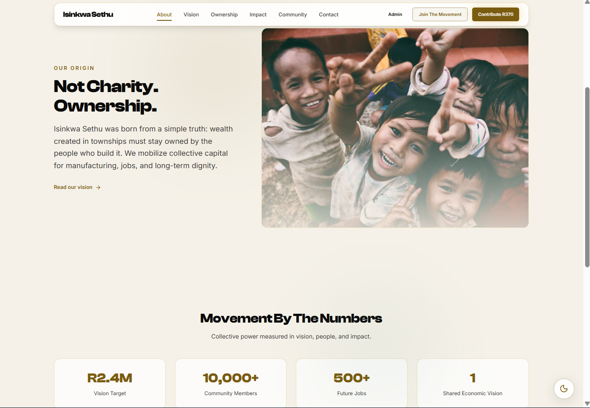
</p>
<p align="center"><sub><b>About</b> — movement story, origin narrative, and key numbers</sub></p>

<p align="center">
  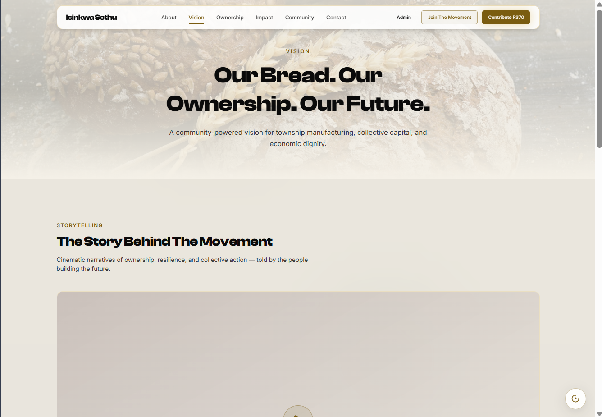
</p>
<p align="center"><sub><b>Vision</b> — community-powered manufacturing and collective capital</sub></p>

<p align="center">
  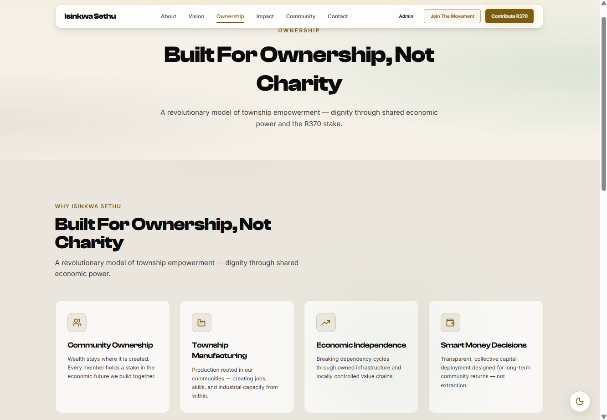
</p>
<p align="center"><sub><b>Ownership</b> — ownership model, R370 concept, and movement pillars</sub></p>

<p align="center">
  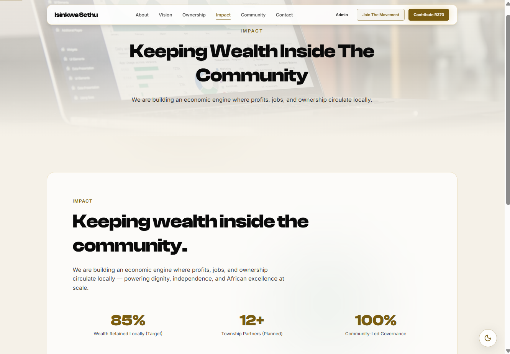
</p>
<p align="center"><sub><b>Impact</b> — local wealth retention and community-led governance</sub></p>

<p align="center">
  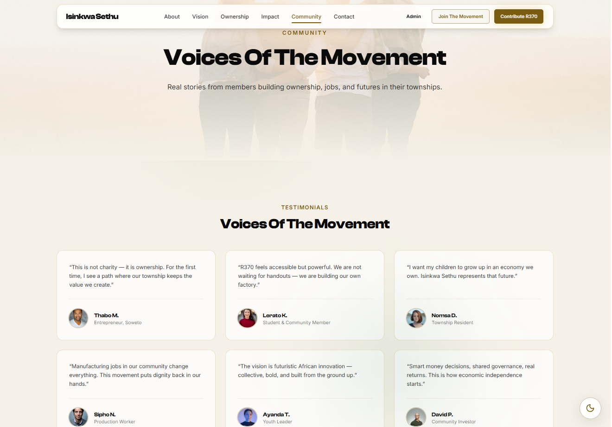
</p>
<p align="center"><sub><b>Community</b> — testimonials and voices from the movement</sub></p>

<p align="center">
  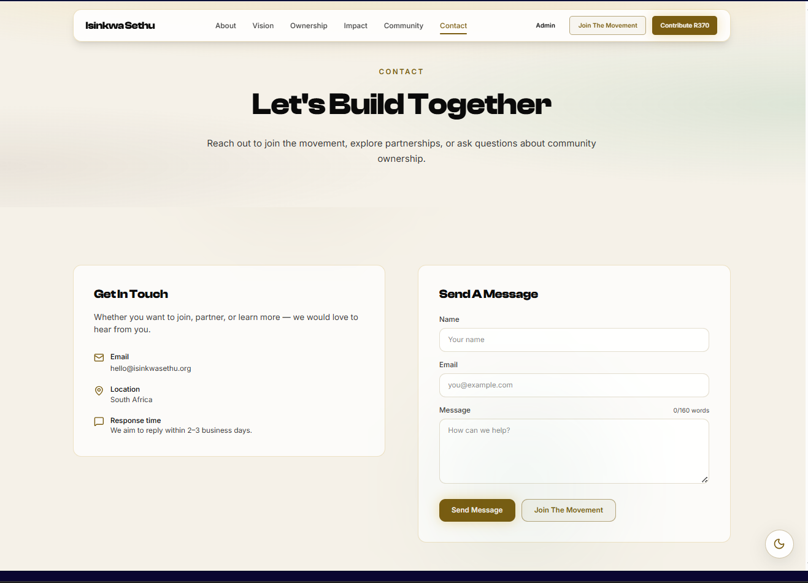
</p>
<p align="center"><sub><b>Contact</b> — contact details and message form (API-backed)</sub></p>

<p align="center">
  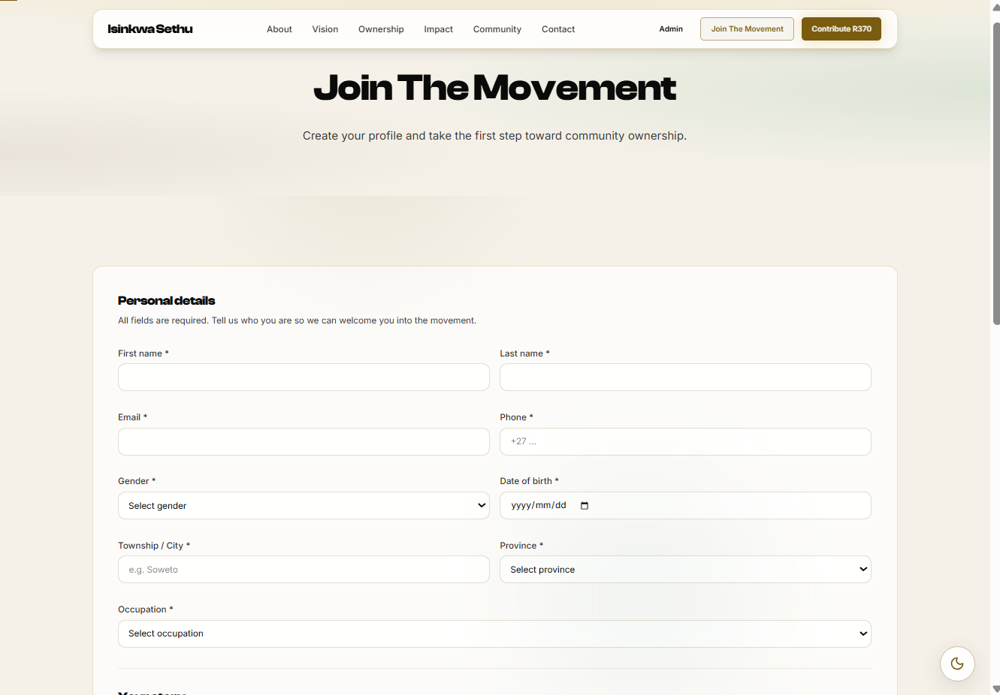
</p>
<p align="center"><sub><b>Join</b> — member onboarding with validation and South African phone format</sub></p>

### Admin portal

<p align="center">
  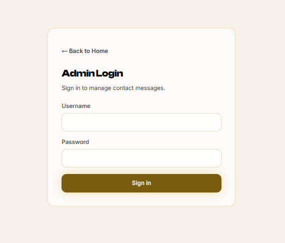
  &nbsp;&nbsp;
  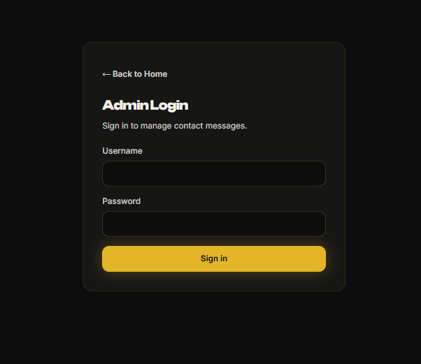
</p>
<p align="center"><sub><b>Admin login</b> — light and dark themes</sub></p>

<p align="center">
  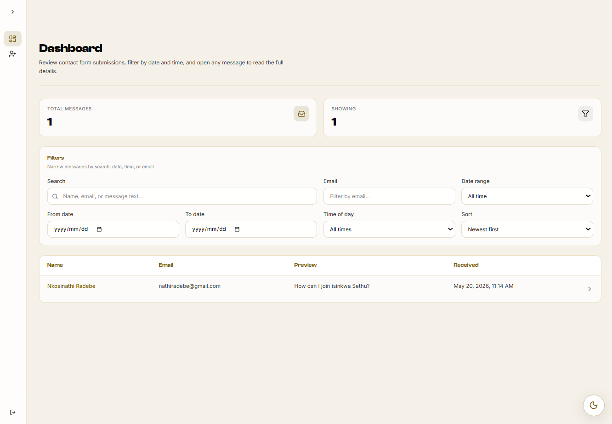
</p>
<p align="center"><sub><b>Admin dashboard (light)</b> — filter, search, and review join requests and messages</sub></p>

<p align="center">
  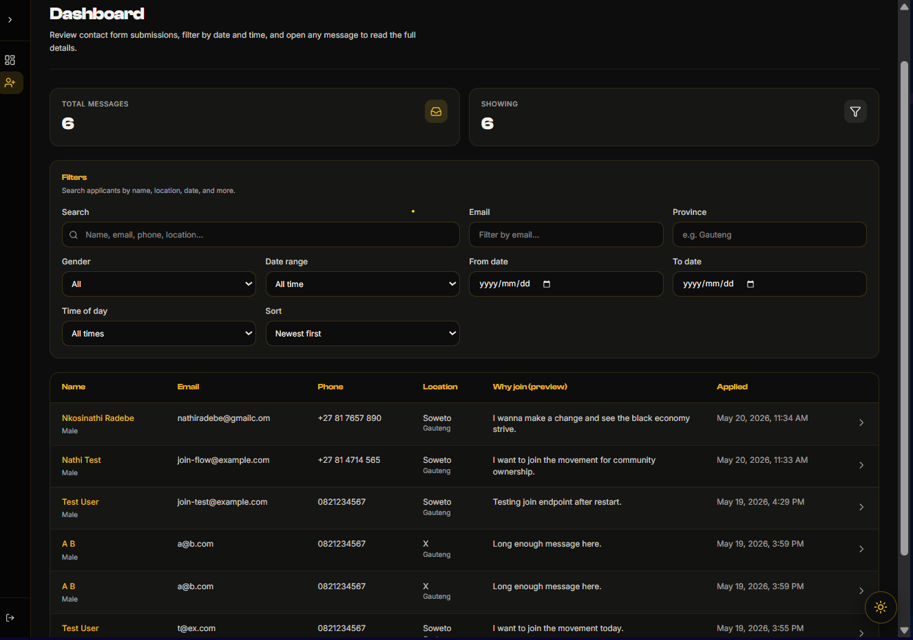
</p>
<p align="center"><sub><b>Admin dashboard (dark)</b> — same tooling with dark theme</sub></p>

---

## Highlights

| Area | What you get |
|------|----------------|
| **Frontend** | React 19, Vite 7, Tailwind v4, Framer Motion, ShadCN UI, React Router |
| **Backend** | FastAPI, SQLAlchemy, JWT admin auth, contact & join-request APIs |
| **UX** | Responsive layout, light/dark mode, animated sections, form validation |
| **Ops** | Render deploy, GitHub Actions CI, optional Sentry monitoring |

## Tech stack

### Frontend (`react/`)

- React 19 + Vite 7
- Tailwind CSS v4
- Framer Motion
- ShadCN UI (Radix) + Lucide React
- React Router
- Sentry (optional, via `VITE_SENTRY_DSN`)

### Backend (`backend/`)

- FastAPI + Uvicorn
- SQLAlchemy (SQLite locally, PostgreSQL in Docker / production)
- JWT admin authentication
- Contact message & join-request APIs

### Infrastructure

- [Render](https://render.com) — static site (frontend) + Docker web service (API)
- GitHub Actions — CI, deploy hooks, promote `deployment_push` → `main`

## Repository structure

```
isinkwa_sethu/
├── react/                 # Frontend app (Vite)
│   ├── src/
│   │   ├── components/    # UI sections, layout, admin, primitives
│   │   ├── pages/         # Route pages + admin
│   │   ├── features/      # Page section modules (optional composition)
│   │   ├── lib/           # API client, utils, monitoring
│   │   ├── assets/        # README screenshots & media
│   │   └── config/        # Site copy, navigation, env helpers
│   └── public/
├── backend/               # FastAPI API
│   ├── app/
│   │   ├── routers/       # contact, admin
│   │   └── ...
│   ├── Dockerfile
│   └── docker-compose.yml # Postgres + API (optional local stack)
├── .github/
│   ├── workflows/         # CI, deployment, merge-to-deployment
│   └── actions/           # Render deploy, promote-to-main
└── render.yaml            # Render blueprint reference
```

## Pages

| Route | Purpose |
|-------|---------|
| `/` | Home — hero, explore, FAQ, CTA |
| `/about` | Movement story and stats |
| `/vision` | Vision, storytelling, timeline |
| `/ownership` | Ownership model and R370 concept |
| `/impact` | Community impact |
| `/community` | Testimonials and voices |
| `/contact` | Contact form (posts to API) |
| `/join` | Join the movement — member application |
| `/admin/login` | Admin sign-in |
| `/admin/dashboard` | View messages & join requests (JWT) |

## Local development

### Prerequisites

- Node.js 22+
- Python 3.12+
- (Optional) Docker for Postgres via `docker-compose`

### 1. Backend

```bash
cd backend
cp .env.example .env
# Edit .env: DATABASE_URL, JWT_SECRET, ADMIN_USERNAME, ADMIN_PASSWORD, CORS_ORIGINS

# SQLite (simplest)
py main.py

# Or Docker (Postgres)
docker compose up --build
```

API runs at **http://localhost:8000** (`/health`, `/api/contact`, `/api/admin/*`).

### 2. Frontend

```bash
cd react
cp .env.example .env
# Leave VITE_API_URL empty for local dev (Vite proxies /api → :8000)

npm install
npm run dev
```

Site runs at **http://localhost:5173**.

### Environment behaviour

| Context | Frontend API | Backend CORS |
|--------|----------------|--------------|
| Local dev | Empty `VITE_API_URL` → Vite proxy to `:8000` | `localhost:5173` in `CORS_ORIGINS` |
| Production build | `VITE_API_URL` → Render API URL | `https://isinkwa-sethu-web.onrender.com` |

See `react/.env.production` and `react/src/config/env.js` for production defaults.

## Scripts

**Frontend** (`react/`):

```bash
npm run dev      # Dev server
npm run build    # Production build → dist/
npm run lint     # ESLint
npm run preview  # Preview production build
```

**Backend** (`backend/`):

```bash
py main.py       # Dev server (reload when not on Render/Docker)
```

## Deployment

Deploys are driven by pushes to **`deployment_push`** (see `.github/workflows/deployment.yml`):

1. Build frontend with production `VITE_API_URL`
2. Trigger Render **frontend** deploy hook (`Frontend_Deploy_Hook` secret)
3. Trigger Render **backend** deploy hook (`Backend_Deploy_Hook` secret)
4. Open/merge PR **`deployment_push` → `main`** (conflicts resolve in favour of incoming deployment code)

### Required GitHub secrets

| Secret | Purpose |
|--------|---------|
| `Frontend_Deploy_Hook` | Render static site deploy hook |
| `Backend_Deploy_Hook` | Render Docker API deploy hook |

### Render environment (recommended)

**Static site** (`react/`):

- `VITE_API_URL` = `https://isinkwa-sethu-web-kpnm.onrender.com`

**Docker API** (`backend/`):

- `CORS_ORIGINS` = `https://isinkwa-sethu-web.onrender.com`
- `DATABASE_URL` = your Postgres connection string
- `JWT_SECRET` = strong secret
- `ADMIN_USERNAME` / `ADMIN_PASSWORD` = admin credentials

## CI

On `main`, `master`, and PRs: **lint + build** for `react/` (`.github/workflows/ci.yml`).

## Brand positioning

- Community **ownership**, dignity, and African excellence
- Township empowerment and economic independence
- Collective action and shared infrastructure—not dependency or generic NGO framing

---

## Developer

**Nkosinathi Radebe** — original developer of this project.

If you use, fork, or adapt this repository, please **credit Nkosinathi Radebe** as the developer (e.g. in your README, documentation, or about page).

---

## License

This project is shared as a **demo / prototype**. You may use, copy, modify, and distribute this code for learning, portfolios, or building your own projects.

**Conditions:**

1. **Attribution** — You must acknowledge **Nkosinathi Radebe** as the original developer.
2. **No warranty** — The software is provided “as is”, without warranty of any kind.
3. **Your responsibility** — Anything you build or do with this code is **your responsibility**. The author is **not liable** for misuse, fraud, illegal activity, financial loss, or harm arising from use of this repository.
4. **Demo only** — This is not production financial, legal, or investment advice. Treat it as a demonstration of a movement-style web platform, not an official product or service.

See [LICENSE](LICENSE) for the full text.

